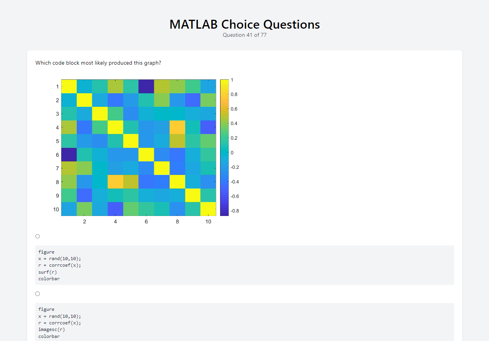
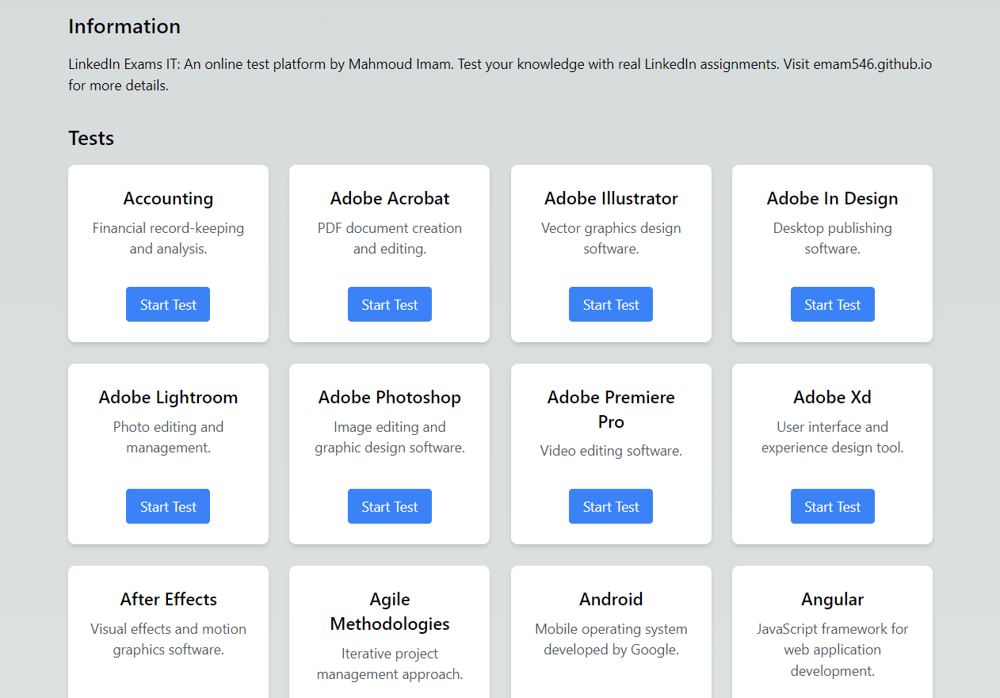

# LinkedIn Skill Assessments Quizzes

This project is a website that allows users to practice skill assessments quizzes from LinkedIn. It fetches the quizzes from the [LinkedIn Skill Assessments Quizzes](https://github.com/Ebazhanov/linkedin-skill-assessments-quizzes/blob/main/javascript/javascript-quiz.md) repository and provides an interactive interface for users to test their skills before taking the actual exams on LinkedIn.


## Live Demo

You can access the live demo [here](https://emam546.github.io/linkedin-quizzes).

## Description

The LinkedIn Skill Assessments Quizzes project is built with Next.js, Tailwind CSS, and uses the `marked` library for parsing and rendering Markdown content. It allows users to select specific skill assessments and answer quiz questions related to that skill. The project provides a user-friendly interface, making it easy for users to navigate through different quizzes and check their answers.

## Features

- Fetches skill assessments quizzes from the LinkedIn repository.
- Renders quiz questions and options dynamically.
- Allows users to select and attempt quizzes based on their preferred skill.
- Provides immediate feedback on quiz answers.
-**** Keeps track of the user's progress and displays the overall score.
- Responsive design for seamless usage on different devices.

## Getting Started

To run the project locally, follow these steps:

1. Clone the repository:

   ```shell
   git clone https://github.com/your-username/linkedin-quizzes.git
   ```
2. Install the dependencies:

   ```shell
   npm install
   ```

3. Start the development server:

  ```shell
   npm dev
   ```
| Route          | Description                                  |
|----------------|----------------------------------------------|
| /              | Home page with list of available quizzes      |
| /[name]        | Quiz page for a specific skill                |
| /[name]/[id]   | Quiz page for question id          |
| /about         | About page providing project details          |
| /contact       | Contact page for reaching out                 |
| /404           | Error page for invalid routes                 |
****